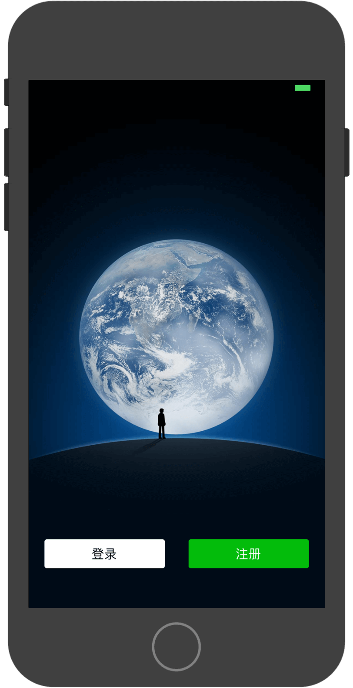
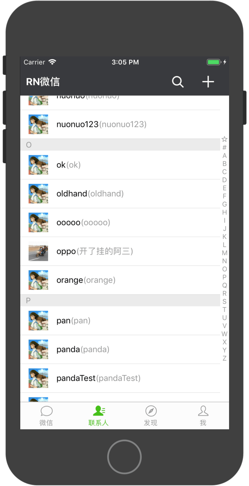
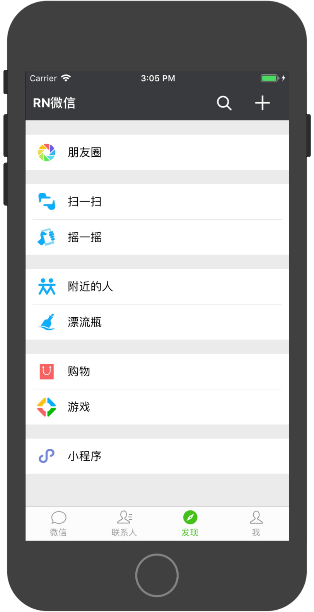
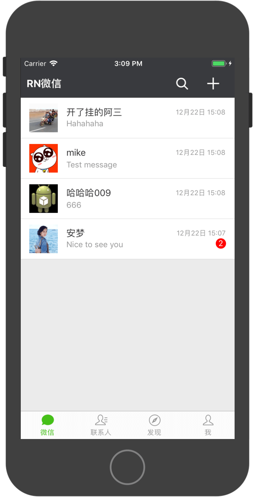
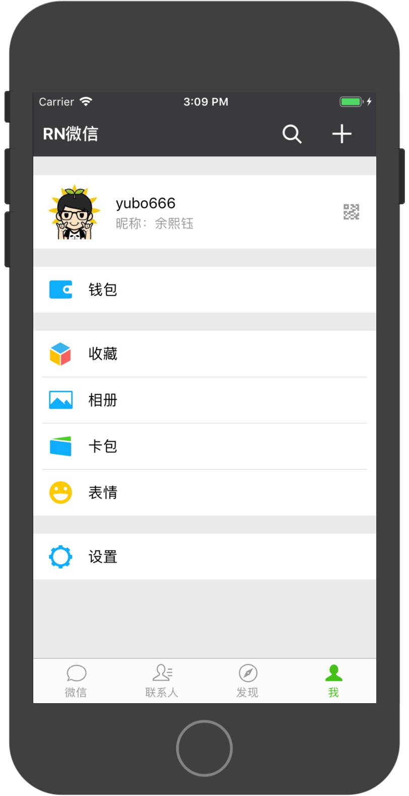
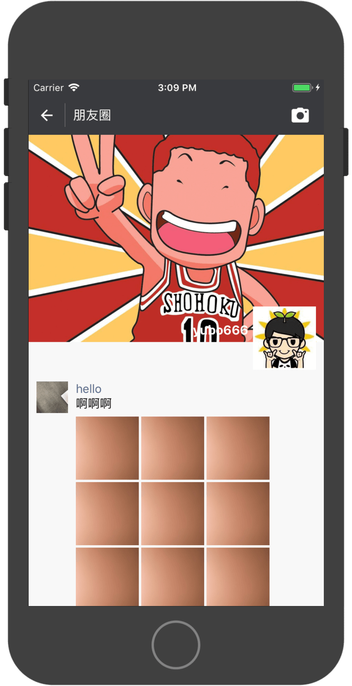
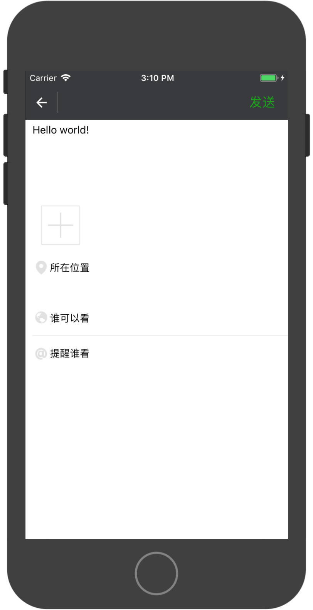
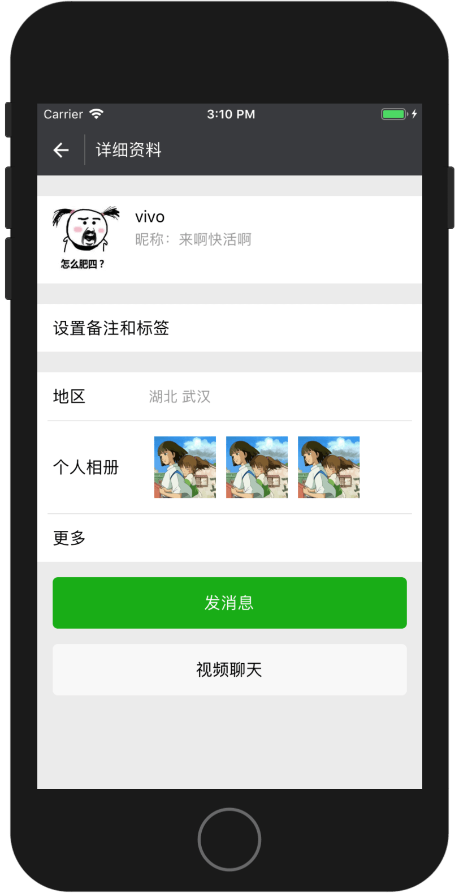

# RNWeChat
* 使用ReactNative开发的仿微信客户端，**支持Android和iOS**，欢迎大家给个star或fork，谢谢~~
* 如果在项目构建过程中有任何问题，欢迎提issue，我有空一定帮忙解答~~
* 我新建了一个QQ群，各位如果有任何与该项目有关的问题，或者想交流下ReactNative相关的技术，都可以加进来：419213248
* iOS的朋友如果运行项目出现问题，可以参考<a href="./iOS-README.md">这个文档</a>

# Android扫码下载体验


# 运行方法
1. 克隆代码：

```
git clone git@github.com:yubo725/rn-wechat.git
```

2. 进入项目根目录并安装依赖：

```
cd RNWeChat
npm install
```

3. 运行项目到模拟器或真机：

```
// Android
react-native run-android

// iOS
react-native run-ios
```

# 注意
* **目前接口做了限制，频繁请求的话可能导致IP被暂时封掉，而且每个IP每天的请求流量也是有限制的，所以不要频繁请求接口**

* **若在Linux或Mac环境打Android包时遇到错误提示：**

> Make sure you have an Android emulator running or a device connected and have set up your Android development environment

**请确保项目的android目录下的gradlew文件有可执行权限，若无可执行权限，改成可执行**

* Android打release包时请使用自己的签名文件和签名配置，具体请参考文档：[打包APK](https://reactnative.cn/docs/0.51/signed-apk-android/)

# 已实现功能
- [x] 登录、注册
- [x] 单聊发送文本与图片
- [x] 发朋友圈
- [x] 朋友圈点赞与评论
- [x] 与机器人聊天
- [x] 修改昵称与头像

# 未实现功能
- [ ] 群聊
- [ ] 发送位置、表情、文件、视频等
- [ ] 适配刘海屏

# 更新记录
* 2019-05-14 服务器迁移，域名更改为rnwechat.yubo.me，原来的代码移到deprecated分支，目前使用dev开发分支，IM采用极光IM
* 2018-12-22 更新项目，RN为当前的最新版本0.57.8，react-navigation库为当前的最新版本3.x
* 2018-03-09 删除react-native-camera库和ac-qrcode库，扫一扫功能不可用(由于官方react-native-camera库更新了，导致我的iOS项目里使用一直报错无法解决，遂暂时去掉扫一扫功能，后续解决问题了再恢复)
* 2018-01-19 加入图灵聊天机器人
* 2018-01-10 接口做上传限制，禁止上传非图片类型的文件
* 2018-01-09 服务端迁移，域名改为app.yubo725.top
* 2017-10-11 修复客户端和服务端的某些bug，由于服务端代码回退和覆盖导致客户端修改头像修改昵称的功能不可用，目前已恢复。
* 2017-10-09 UI适配iOS。
* 2017-09-30 代码适配iOS（目前还有一些小问题），加入iOS截图，修复之前的一些bug。
* 2017-09-29 删除网易云信IM，改用环信IM（网易巨坑，免费版超过100人无法收发消息，文档里又没有注明，法克！！！）。
* 2017-09-15 聊天界面显示消息时间。
* 2017-09-13 加入单聊功能，目前仅支持文本消息，加入修改昵称的功能。
* 2017-09-06 加入摇一摇页面，加入APP更新对话框（该更新不是热更新，而是下载apk覆盖安装的更新，等后面完成所有功能的开发后再加入热更新功能），修复某些bug。
* 2017-09-05 完成朋友圈的点赞和评论功能，为了逻辑简单，只做了针对楼主的评论，没有做针对回复人的评论。
* 2017-08-29 完成发朋友圈的功能。
* 2017-08-24 加入个人信息页面，加入修改头像的功能。
* 2017-08-18 修改注册和登录功能，加入了网易云信SDK。
* 2017-08-15 加入注册、登录和注销功能，可以注册新用户，IM功能采用了网易云信SDK。
* 2017-08-11 加入扫一扫功能，加入登录注册页面，登录和注册的功能后面实现，加入购物页面和卡包页面。
* 2017-06-08 修改联系人数据从服务端获取，包括联系人姓名、头像等，其他部分数据暂时为测试数据。

# 截图

## iOS截图（iPhone8）
<div>



</div>
<div>



</div>
<div>



</div>

## Android截图


