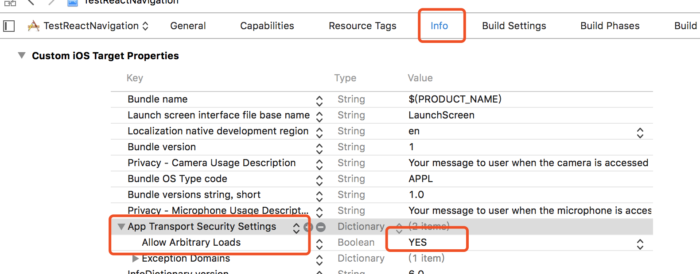

# iOS运行说明
很多朋友在iOS下运行不起来，这里说明下自己在iOS下运行RNWechat的过程，我的开发环境是：macOS 10.11，ReactNative版本0.44.2，xcode版本7.2

# 2018-3-9补充
由于官方的react-native-camera库做了升级，导致我在运行RNWeChat项目时一直报错无法解决，目前暂时删掉了扫一扫功能，去除了react-native-camera库和ac-qrcode库，RNWeChat目前可以在iOS上正常运行。

# 步骤
1. 克隆代码
```
git clone https://github.com/yubo725/RNWeChat.git
```

2. 进入项目根目录，并安装相关依赖
```
cd RNWeChat
npm install
```

3. 进入ios目录，并安装pod依赖
```
cd ios
pod install
```

4. 用xcode打开ios/TestReactNavigation.xcworkspace文件

5. run项目，如果有报错，注释掉报错的相关代码直到没有任何报错信息

# 注意
iOS需要做如下配置才能使用网络

